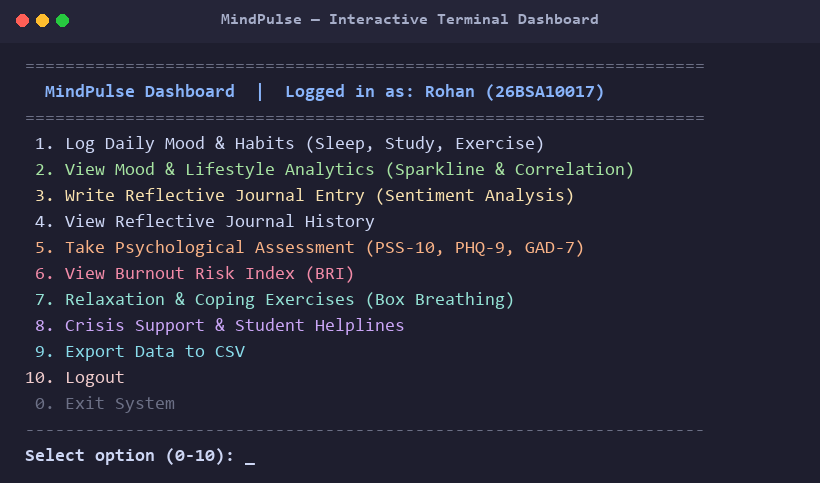
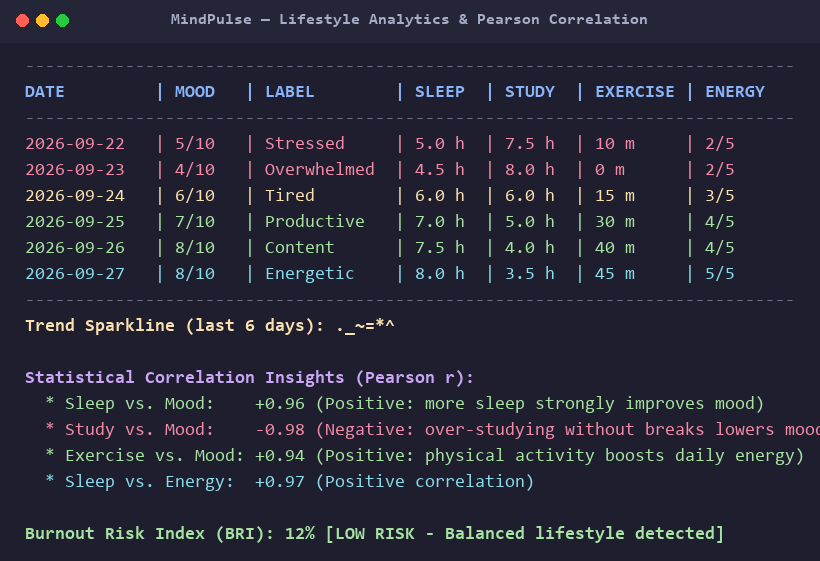
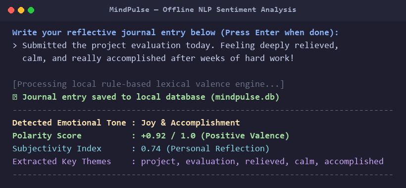
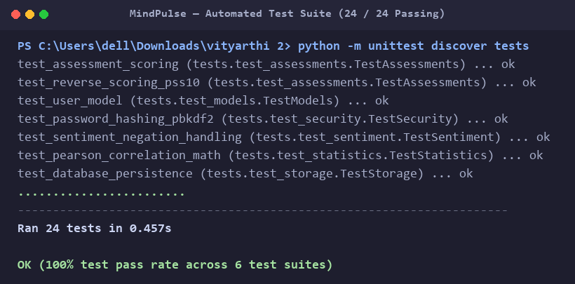

# MindPulse - Student Wellness and Habit Tracker

A Python terminal application built for tracking daily student wellness, study-sleep habits, and stress levels.

## About the Project
As students in college, we often deal with bad sleep schedules, long study hours before exams, and everyday stress. Most wellness apps on the Play Store or App Store either ask for a paid monthly subscription or upload all your personal journals to their cloud servers.

I made MindPulse as an offline-first Python project for the VITyarthi flipped course evaluation. It runs directly in the command prompt or terminal and stores everything locally on your own computer in an SQLite database. It lets students record daily mood and habits, write private journal reflections, take standard psychology screening tests (like PSS-10 for stress), and see correlations between their study hours, sleep, and overall mood.

## What It Does

I built MindPulse to cover the everyday things a student actually needs without making it complicated:

1. **Secure Login without Cloud Accounts**: You create your own username and password on your laptop. Passwords use PBKDF2 hashing with random salts, so even if someone opens the sqlite database file, they can't read your password.
2. **Quick Habit & Mood Check-in**: In under 30 seconds, you can log how you're feeling (1 to 10), sleep hours, study time, exercise, and energy levels. It prevents bogus inputs like negative hours or mood ratings over 10.
3. **Private Diary with Sentiment Scoring**: You can write whatever is on your mind. A local Python algorithm scans for positive/negative words (handling tricky phrases like "not feeling good" or "barely slept") and scores your mood from -1.0 to +1.0.
4. **Three Real Psychological Tests**:
   - PSS-10 for overall perceived stress (with proper reverse scoring on positive questions).
   - PHQ-9 for depression screening.
   - GAD-7 for anxiety levels.
5. **Math Correlations & Burnout Alerts**: Uses the Pearson formula ($r$) to calculate if your sleep hours actually improve your mood, and warns you if your last 7 days show dangerous burnout patterns.
6. **Breathing Guides & Emergency Helplines**: Has guided terminal exercises (like Box Breathing) to calm down during study stress, and lists verified student helplines (like Tele-MANAS).
7. **CSV Export**: Lets you dump your logged history into an Excel-friendly CSV file whenever you want to keep a personal backup or view it in Microsoft Excel.

## Built With (Tools & Libraries)
- Python 3 (tested on Python 3.10 and 3.13)
- SQLite3: Built-in database for saving user data, logs, and assessments.
- hashlib & hmac: Standard library security tools for password encryption.
- math & re: For statistical math formulas and text parsing.
- unittest: Python's testing framework used to verify all functions.

No third-party packages need to be installed to run the application itself—it runs purely on the standard Python library.

## Project Structure
Here is how the project files are arranged:
```
vityarthi 2/
├── main.py               # Main entry file to run the project
├── mindpulse_standalone.py # Consolidated single-file version
├── README.md             # Project documentation and guide
├── statement.md          # Project problem statement and scope
├── Project_Report.pdf    # Full 15-chapter project report
├── requirements.txt      # Dependency list
├── run.bat               # Windows double-click shortcut to start the app
├── run_tests.bat         # Windows shortcut to run unit tests
├── data/                 # Folder where mindpulse.db and exported CSVs are kept
├── screenshots/          # Terminal execution captures and diagrams
├── src/                  # Modular source code
│   ├── analytics/        # Sentiment analysis and Pearson correlation math
│   ├── assessments/      # PSS-10, PHQ-9, GAD-7 tests and coping advice
│   ├── core/             # Data models and custom exceptions
│   ├── security/         # Password hashing and login verification
│   ├── storage/          # SQLite database connection and query functions
│   └── ui/               # Terminal menus, color codes, and table displays
└── tests/                # Automated test cases
    ├── test_assessments.py
    ├── test_models.py
    ├── test_security.py
    ├── test_sentiment.py
    ├── test_statistics.py
    └── test_storage.py
```

## How to Install and Run

### 1. Requirements
Make sure you have Python 3 installed on your computer. You can check by typing in your terminal:
```bash
python --version
```

### 2. Running the App
You can start the program in either of two ways:
- On Windows: Simply double-click `run.bat`.
- From the Terminal / PowerShell:
```bash
python main.py
```
Or if you prefer running the single-file version:
```bash
python mindpulse_standalone.py
```

## How to Run Tests
The project comes with 24 automated unit tests that verify user login, database storage, sentiment scoring, and math formulas.

To run all tests:
- On Windows: Double click `run_tests.bat`.
- From the command prompt:
```bash
python -m unittest discover tests
```

Expected result:
```
........................
----------------------------------------------------------------------
Ran 24 tests in 0.48s

OK
```

## Terminal Screenshots & Sample Outputs

### 1. Interactive Dashboard


### 2. Lifestyle Analytics & Habit Correlations


### 3. Reflective Journaling & Sentiment Engine


### 4. Automated Test Verification (24 / 24 Passing)

